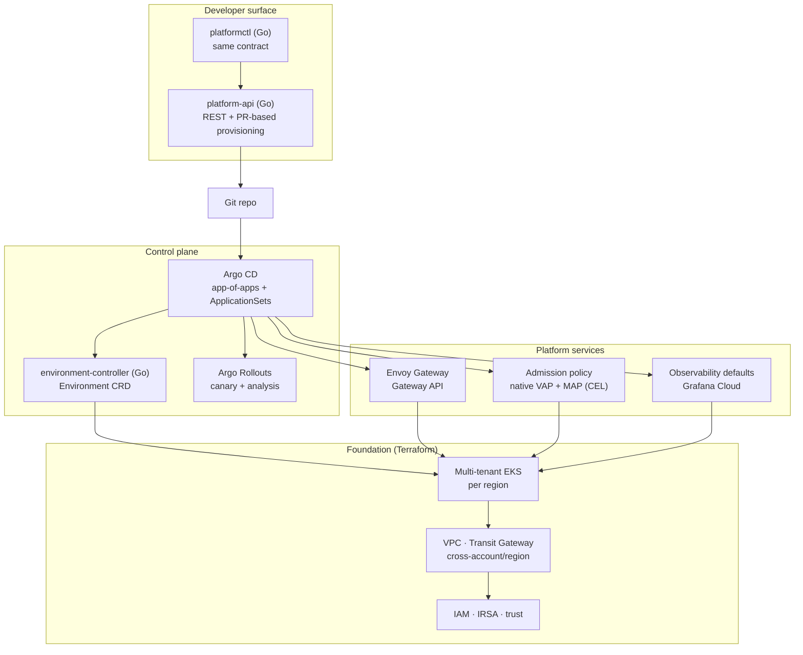
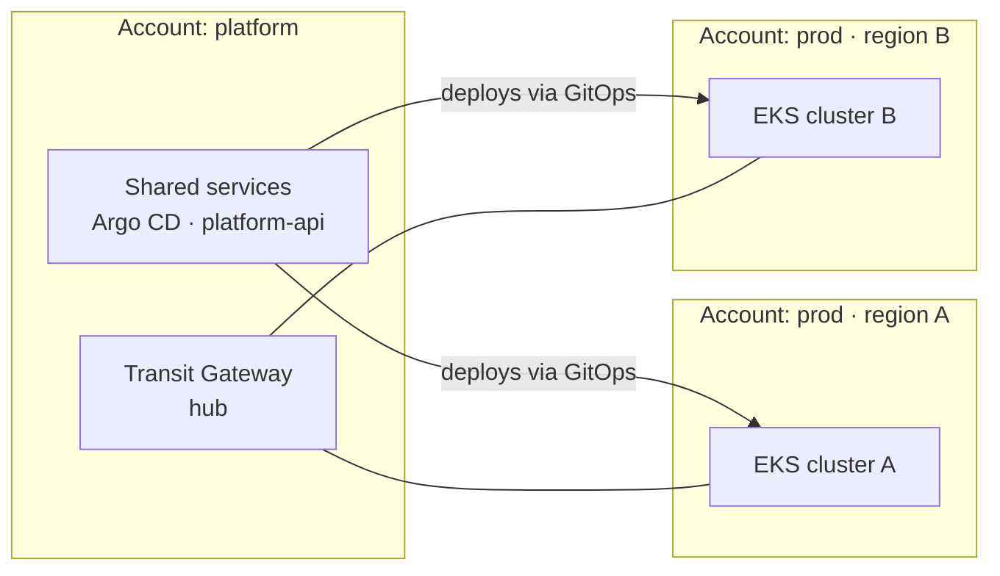

# Architecture

> How the paved road is put together, and — more importantly — where its boundaries are.

**Status:** design baseline · **Cloud:** AWS (multi-account, multi-region) · **Runtime:** EKS

---

## 1. Design principles

- **The easy path is the safe path.** Every guardrail must make the compliant route *faster* than the non-compliant one. A guardrail that slows teams down gets routed around, and then it protects nothing.
- **Git is the only write path.** Self-service does not mean direct mutation. The provisioning API opens a PR; Argo CD reconciles. Every change has an author, a diff, and a revert.
- **Two-layer provisioning.** Terraform owns the *foundation* that changes rarely (accounts, networks, clusters, identity). The platform's own controllers own everything that changes per-team and per-day. If you're editing Terraform weekly, something is in the wrong layer.
- **Multi-region from the first line.** Not "we'll add regions later" — the module and ApplicationSet structure assume N regions from day one, because retrofitting region-awareness is the expensive version.
- **Ownership is mandatory.** Nothing exists in this platform without a named owning team. Unowned resources are how platforms rot.
- **Defaults over documentation.** A safe default that ships automatically beats a wiki page asking teams to remember. Docs explain the default; they don't substitute for it.
- **Measure adoption.** Every capability reports whether it's actually used. Unused paved roads are design failures, not user failures.

---

## 2. Layered view

Read it top-down as a consuming team, bottom-up as a platform engineer.

---

## 3. The self-service ↔ guardrail contract

The heart of the platform. Read each row as *"a team can do X themselves, because the platform guarantees Y."*
**No row grants self-service without a matching guardrail** — and no guardrail requires a ticket.

| A team can self-serve… | …because the platform guarantees | Enforced by |
|---|---|---|
| A new application environment | Quotas, network policy, and ownership labels are correct by construction | `environment-controller` reconciling the `Environment` CRD |
| A deployment to production | It rolls out progressively and reverts itself on regression | Argo Rollouts canary + automated analysis |
| Ingress + a public hostname | TLS, DNS, and route isolation are handled; no team writes raw gateway config | Envoy Gateway (platform owns `Gateway`, teams own `HTTPRoute`) |
| Running a container image | Only approved registries and images with provenance can run | Native admission policy, plus Kyverno for signature verification (ADR-0004) |
| Their own observability | Dashboards, alert routing, and an SLO exist from minute one | Observability defaults injected per environment |
| Deleting their environment | Teardown is complete, and recoverable from Git | Controller ownership + GitOps history |

**Design rule:** if a new capability can't name its guardrail, it isn't ready to be self-service. If a
guardrail can only be satisfied by asking the platform team, it's a gate — redesign it as a default, a
mutation, or a template.

### Where guardrails actually run

Three layers, each with a different job. Full reasoning in [ADR-0004](./docs/adr/0004-policy-enforcement-layers.md).

| Layer | What it catches | Why here |
|---|---|---|
| **Request time** — `platform-api` (Go) | Naming, ownership, capacity headroom, tier and budget rules | The only layer a team actually experiences. Fast, and the error message can explain itself: "your team's budget is 32 CPUs, here's who to ask." |
| **Admission** — native ValidatingAdmissionPolicy + MutatingAdmissionPolicy (CEL) | Resource limits, image registries, required labels, no `:latest`; MAP injects safe defaults | Backstop for anything that skipped the API. Runs in-process, so nothing to install or upgrade and no webhook that can fail open. |
| **Supply chain** — Kyverno, narrowly | Image signature and attestation verification | CEL can't make external calls, so signature checks need something that can. This is the only job Kyverno has here. |

Admission is the *last* place to catch something, not the first. By the time a manifest is rejected, the
engineer has already written the config, opened a PR and waited for a sync. Correct, but a poor experience —
which is why the request-time layer carries most of the weight.

Note that `generate`-style policy isn't needed: the `environment-controller` already creates namespaces,
quotas and network policies. Having a policy engine generate them too would give the same objects two owners.

---

## 4. The Go platform surface

Three surfaces, **one contract** — the `Environment` spec. This is deliberate: the API, the CLI, and the
controller must never drift, so the CRD type is the single source of truth and the others consume it.

| Component | Responsibility | Explicitly not |
|---|---|---|
| **`platform-api`** | Validate requests against policy, render manifests, open a PR, report status/adoption | Mutating clusters directly |
| **`environment-controller`** | Reconcile `Environment` → namespace, quota, netpol, route, observability defaults, SLO | Deciding *whether* an environment is allowed (that's the API + policy) |
| **`platformctl`** | Ergonomic access to the same API; scriptable | Having its own private behaviour |

**Why PR-based rather than direct provisioning:** self-service through Git keeps the audit trail, the
review option, and the revert path — which is what makes it safe to hand out. Teams get speed; the platform
keeps a diff of every change. The API returns a PR link and tracks it to merge.

**Why a controller and not just Terraform:** environments are created and destroyed constantly and must
self-heal. Terraform is the wrong tool for a continuously-reconciled, per-team object — that's exactly the
two-layer boundary in §1.

---

## 5. Multi-region, cross-account model

- **Accounts are the blast-radius boundary**; regions are a deployment variable, not a fork of the code.
- Argo CD **ApplicationSets** generate per-region Applications from labels, so bringing up region *N+1* means adding a target — not writing manifests.
- Cross-account access uses assumed roles with least privilege; no long-lived keys anywhere.
- **The test of the design:** adding a region should touch a variable file and a generator, nothing else. If it touches modules, the abstraction leaked.

---

## 6. Reliability model

- **SLOs on the platform's own services first.** If provisioning is unreliable, teams stop trusting the paved road and go back to asking humans — so the platform's availability *is* the adoption strategy.
- **Alerts derive from SLOs and error budgets**, not from raw resource metrics. Every alert links to a runbook; an alert without one is a bug to fix, not noise to tolerate.
- **Environments inherit monitoring.** Observability is a default, not an integration task.
- **Incidents produce prevention work**, tracked to completion — blameless, but not consequence-free for the system.

---

## 7. Where AI-assisted operations fit (and where they don't)

Automation earns its place at the **context-gathering and recommendation** layer, not the mutation layer:

| Assisted | Always human |
|---|---|
| Assembling alert context (recent deploys, related incidents, dashboards, runbook) | Anything that changes production |
| Suggesting likely causes and next steps, with sources cited | Approving a remediation |
| Answering onboarding/"how do I" questions from platform docs | Policy and guardrail changes |

Every assisted action is logged and attributable. The boundary is written down and reviewed — the point is
being deliberate about it, not maximizing automation.

---

## 8. What "done" looks like

A team that has never spoken to the platform team can: request an environment from a CLI or API → get a PR
→ merge it → and within the hour have a namespace with quotas, network policy, a TLS hostname, progressive
deployment, dashboards, and an SLO — all reconciled from Git, all owned by them, and all correct by
construction. Adding a region is a variable change. When something breaks, on-call gets context and a
runbook instead of a blank page.
