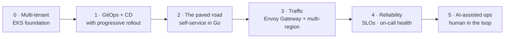

# Build Roadmap

> From "a platform expert provisions it by hand" to "a team self-serves it in under an hour, safely."
> Each phase is a skill unlock with a demoable outcome. Build in order — every phase assumes the last one
> works. See [ARCHITECTURE.md](./ARCHITECTURE.md) for the target design.

**Guiding rule:** get one thin slice working end-to-end early, then widen. A crude self-service path that
actually provisions something teaches more — and proves more — than a perfect Terraform module nobody
consumes.

**The sequencing bet:** foundations first (Phases 0–1), because a self-service layer over shaky foundations
just automates the mess. But don't gold-plate them — the paved road (Phase 2) is where the value shows up,
and building it early surfaces which foundations were actually wrong.

---

## Phase 0 — Multi-tenant EKS foundation (Terraform)

**Goal:** reproducible, multi-account, multi-region-ready AWS foundations — the thing that makes "a new
region" a config change instead of a project.

**Deliverables**
- Terraform modules: `network` (VPC, subnets, routing), `cluster-eks`, `identity` (IRSA), `cross-account` (roles/trust).
- **Multi-account by default**: separate accounts per environment tier, with a documented cross-account access model.
- **Cross-region connectivity** designed in from the start (Transit Gateway or equivalent) — even if only one region is live.
- Remote state (S3 + DynamoDB locking) and a module layout that assumes N regions, not one.
- Multi-tenancy primitives: namespace-per-tenant, quotas, network policy defaults, ownership labels.
- Terraform bootstraps Argo CD, then gets out of the way.

**Skills exercised:** Terraform modules & state, AWS multi-account architecture, EKS, IRSA, network design, the Terraform↔GitOps boundary.

**Done when:** `terraform apply` from zero yields a working EKS cluster in a fresh account with Argo CD running, `destroy` cleans up, and **adding a second region is a variable change plus a pipeline run** — not new code.

---

## Phase 1 — GitOps delivery + the CD flow (Argo CD)

**Goal:** Git is the only write path, and there's a continuous-deployment flow teams can trust — the piece
most platforms are missing.

**Deliverables**
- **App-of-apps** root + **ApplicationSets** that fan out by environment and region (generators keyed on `env` / `region` labels), so a new environment or region inherits the whole platform automatically.
- Sync waves ordering (CRDs → controllers → workloads).
- **Progressive rollout** with Argo Rollouts: canary steps with automated analysis and rollback.
- **Testing in the delivery path**: manifest validation, policy checks, and a smoke/integration gate before promotion — the difference between "CD" and "auto-apply and hope."
- **Admission guardrails** using native ValidatingAdmissionPolicy and MutatingAdmissionPolicy (CEL): resource limits required, approved registries only, no `:latest`, owner labels enforced, safe defaults injected. Ship them in audit mode first, then enforce. See [ADR-0004](./docs/adr/0004-policy-enforcement-layers.md) for why this isn't Kyverno by default.
- Promotion between environments as a Git operation with an audit trail.

**Skills exercised:** Argo CD app-of-apps & ApplicationSets, multi-cluster fan-out, sync waves, progressive delivery, deployment testing strategy.

**Done when:** merging a change promotes it through environments with canary analysis and automatic rollback on regression, and a brand-new environment picks up every platform component with no manual steps.

---

## Phase 2 — The paved road: self-service environments (Go)

**Goal:** the core of the whole project. A team creates a new application environment themselves, in
minutes, and it arrives correct by construction.

**Deliverables** — one contract, three surfaces:
1. **`platform-api`** (Go) — `POST /v1/environments` validates the request against policy, renders manifests, and **opens a PR** to the GitOps repo. Self-service without giving up Git as the write path.
2. **`environment-controller`** (Go) — an `Environment` CRD + reconciler that materializes the environment: namespace, quota, network policy, ownership labels, gateway route, observability defaults, and a default SLO.
3. **`platformctl`** (Go/Cobra) — a CLI over the same contract, because engineers live in terminals.
- **Ownership is mandatory** — no environment exists without a named owning team and a contact path.
- **Docs + contract**: a versioned API spec and a "how to get an environment" page that a new engineer can follow unaided.
- **Adoption instrumentation** from day one: count self-served vs. expert-assisted provisions.

**Skills exercised:** Go service + controller design (controller-runtime), API contract design, GitOps-native automation, multi-tenancy, platform-as-product thinking.

**Done when:** an engineer who has never touched the platform team goes from nothing to a working environment in **under an hour**, without asking anyone — and the platform can show the count.

> 🎯 **The milestone that matters.** Everything after this makes the paved road faster, safer, and more
> observable.

---

## Phase 3 — Traffic: Envoy Gateway + multi-region routing

**Goal:** environments get ingress, routing, and cross-region reachability as a default, not a ticket.

**Deliverables**
- **Envoy Gateway** implementing **Gateway API**; the platform owns `Gateway`, teams own `HTTPRoute`.
- Routes provisioned automatically by the `Environment` controller (DNS + TLS included).
- Multi-region traffic: health-based routing/failover between regions, and a documented failover behaviour.
- Cross-account/cross-region service connectivity validated end to end.
- mTLS or equivalent transport security between services, and an authorization default.

**Skills exercised:** Gateway API vs legacy Ingress, Envoy operations, DNS/TLS automation, multi-region traffic design, failover testing.

**Done when:** a new environment is reachable over TLS at a predictable hostname with zero manual networking, and a region failover drill moves traffic without a code change.

---

## Phase 4 — Reliability: SLOs, alerting, and on-call health

**Goal:** production gets safer and less dependent on heroics — and on-call stops being a tax.

**Deliverables**
- **SLOs** for the platform's own services (provisioning API availability/latency, delivery pipeline success) defined in code, with error budgets.
- **Grafana Cloud** dashboards + alerts derived from SLOs, not from raw noise.
- **Observability defaults injected per environment**: every new environment ships with dashboards, alert routing, and log/metric pipelines already wired.
- **Runbooks** linked from every alert; alerts without a runbook are a bug.
- **Blameless postmortems** with prevention actions tracked to completion.
- An **alert quality review**: measure noisy/actionable ratio and delete or fix the noise.

**Skills exercised:** SLO/error-budget practice, alert design, observability as a platform default, incident response, toil reduction.

**Done when:** every platform service has an SLO with an error budget, every alert links to a runbook, and a new environment inherits monitoring without its team configuring anything.

---

## Phase 5 — AI-assisted operations (human in the loop)

**Goal:** cut operational toil where it's safe to, and be explicit about where it isn't. The value here is
**judgment about boundaries**, not the automation itself.

**Deliverables**
- **Alert enrichment**: when an alert fires, automatically assemble recent deploys, related incidents, relevant dashboards, and the linked runbook — so on-call starts with context instead of a blank page.
- **Runbook-assisted diagnosis**: suggest likely causes and next steps from runbooks + telemetry. **Recommendations only.**
- **An onboarding assistant** that answers the questions the platform experts answer today, grounded in the platform's own docs.
- **Hard boundaries, written down**: nothing that mutates production runs without a human approving it; every assisted action is logged and auditable; suggestions are attributable to a source.

**Skills exercised:** operational automation, retrieval over internal docs/telemetry, human-in-the-loop design, honest assessment of where automation earns its place.

**Done when:** on-call opens an incident and finds context already assembled, every suggestion cites its source, and a written policy states exactly which actions may never be automated — with the reasoning.

---

---

## Deliberately not in scope (and when that changes)

Two conventional tools are excluded from v1 — see [ADR-0003](./docs/adr/0003-no-portal-or-crossplane-in-v1.md)
for the full reasoning and the revisit triggers:

- **A developer portal (Backstage)** — the API and CLI are the durable contract; a portal is presentation over it. Add it when the org's problem becomes *discovery* ("what exists, who owns it") rather than provisioning latency.
- **Crossplane** — environment provisioning is procedural and belongs in testable Go. Add it when teams need **cloud resources** (databases, buckets, queues) alongside environments; the boundary would be controller → Kubernetes objects, Crossplane → cloud resources.

Knowing what not to build is part of the job. Both are demonstrated in a sibling project, so exclusion here
is scoping, not unfamiliarity.

---

## Cross-cutting practices (every phase)

- **RFC before big changes.** Ambiguous problem → written proposal → review → decision. See [docs/rfc/](./docs/rfc/).
- **ADR after every non-obvious decision.** Short, dated, with the alternatives you rejected.
- **Runbook after every failure.** If it broke once, it gets a runbook.
- **Measure adoption, not output.** Self-served vs. assisted provisions, time-to-environment, change failure rate.
- **Docs are part of the deliverable.** A capability nobody can find or use isn't done.

## Suggested cadence

Phases 0–1 are foundations and go quickly if you're disciplined about not gold-plating. Phase 2 is the
substantial one — it's also the part worth showing anyone. Phases 3–5 deepen it. Working part-time, expect
the first self-service environment (end of Phase 2) to be the natural first milestone to demo.
