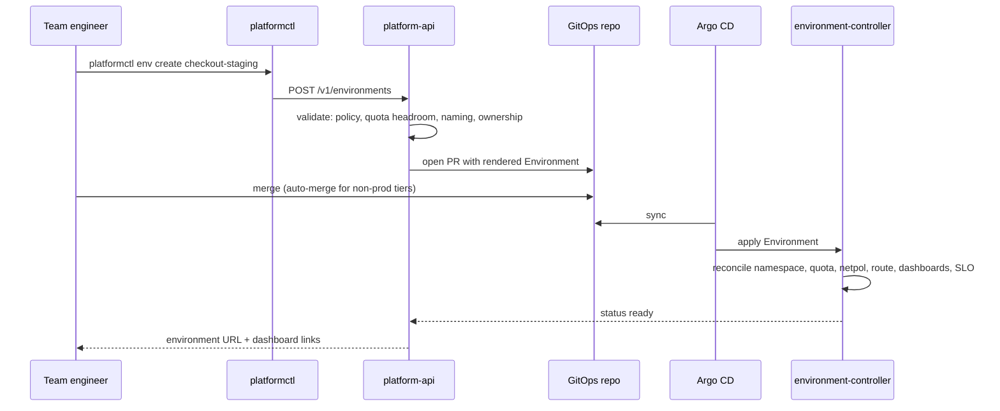

# RFC-0001: Self-service application environments

**Status:** accepted · **Author:** platform · **Created:** 2026-08-03 · **Reviewers:** platform, app teams, security

## Summary

Provisioning a new application environment currently takes **days** and requires a platform engineer to
drive it by hand. This RFC proposes an `Environment` API — a Go service, a Kubernetes controller, and a CLI
sharing one contract — that lets a team provision a correct-by-construction environment themselves in
**under an hour**, without giving up Git as the write path.

## Problem

Environment creation today is expert-driven. The steps are known but distributed across people's heads and
several systems: an account/namespace decision, quotas, network policy, ingress and DNS, deployment
wiring, dashboards, alert routing, and an owner.

This produces four costs:

1. **Latency.** Days of wall-clock time, most of it queueing on one of a handful of experts.
2. **A bus factor.** The same people unblock the same workflows repeatedly; that work is invisible and unschedulable.
3. **Drift.** Hand-built environments differ in ways nobody notices until an incident. "Correct" is whatever the person remembered that day.
4. **Ceiling on growth.** The cost scales with the number of teams, so the platform team becomes the constraint on engineering headcount.

The failure mode we must avoid is equally clear: handing teams raw cluster access removes the latency and
replaces it with inconsistency and unowned resources. **Speed without guardrails just moves the cost to
incident response.**

## Goals

- A team provisions an environment **without platform-team involvement**, in under an hour.
- Every environment is **correct by construction**: quotas, network policy, ingress, observability, and an owner — never optional.
- **Every change is auditable and revertible.**
- The platform can **measure adoption** — self-served vs. expert-assisted.
- Adding a **region** does not change the contract teams use.

## Non-goals

- Replacing Terraform for foundational infrastructure (accounts, VPCs, clusters). See ADR-0001.
- A general-purpose "provision any AWS resource" API. This RFC covers *application environments* only; broadening the surface prematurely is how platform APIs become unmaintainable.
- A web portal. The API and CLI come first; a UI can be added over the same contract later if demand justifies it.

## Proposal

### The contract

One type — `Environment` — defined as a CRD and consumed by all three surfaces so they cannot drift:

```yaml
apiVersion: platform.internal/v1alpha1
kind: Environment
metadata:
  name: checkout-staging
spec:
  owner:                          # mandatory — no unowned environments
    team: checkout
    contact: "#team-checkout"
  tier: staging                   # dev | staging | prod — drives defaults
  region: us-east-1
  resources:
    cpu: "8"
    memory: 16Gi
  ingress:
    enabled: true
    hostname: checkout-staging    # platform completes the domain
```

Everything else — network policy, dashboards, alert routing, SLO, TLS, rollout strategy — is a **tier-driven
default**, not a field. The field surface stays deliberately small; defaults carry the safety.

### The three surfaces

| Surface | Role |
|---|---|
| `platform-api` (Go) | Validates against policy, renders manifests, **opens a PR**, returns a tracking link, records adoption |
| `environment-controller` (Go) | Reconciles the merged `Environment` into namespace, quota, netpol, route, observability, SLO |
| `platformctl` (Go) | Ergonomic CLI over the same API |

### Flow



### Why PR-based instead of direct provisioning

This is the central design decision, and the one most likely to be challenged as "unnecessary friction."

Direct mutation would be marginally faster but would cost us the audit trail, the diff, and the revert path
— the three properties that make it *safe* to hand provisioning to every team. With PR-based flow we keep
Git as the single write path, so an environment's entire history is reconstructable and any change can be
reverted by a commit.

The friction is mitigated by **auto-merge for non-production tiers**: dev and staging environments merge
without human review once policy checks pass, so the PR is a record, not a queue. Production keeps a human
approval. Net effect: minutes for non-prod, with full auditability everywhere.

## Alternatives considered

**A Backstage scaffolder template.** Rejected as the *first* step — it front-loads a portal dependency and
still needs the underlying API to do anything safely. The API is the durable layer; a portal can be added
over it later.

**Crossplane compositions.** A strong fit for the resource-provisioning half, and genuinely close to what we
want. Rejected here mainly because we want the validation, adoption instrumentation, and PR workflow in Go
where we can test it properly, and because environment logic is more procedural than compositional. Worth
re-evaluating if the resource surface grows. (See ADR-0001.)

**Terraform modules teams run themselves.** Rejected: requires distributing credentials, has no
continuous reconciliation, and drift returns immediately. Terraform is right for foundations, wrong for
per-team objects created and destroyed constantly.

**Direct API provisioning without Git.** Rejected as above — loses audit, diff, and revert.

## Risks and mitigations

| Risk | Mitigation |
|---|---|
| The API becomes a new bottleneck (feature requests to the platform team) | Small field surface; tier defaults absorb variation; publish the roadmap for the API itself |
| Teams bypass it via `kubectl` | Restrict direct cluster write access *after* the paved road is demonstrably faster — never before |
| Defaults are wrong for a real use case | Escape hatch: documented process to request a tier change, tracked as a signal to fix defaults |
| Quota exhaustion from easy provisioning | Validation checks capacity headroom at request time; environments have TTLs in non-prod |
| Controller bugs break many environments at once | Progressive rollout of the controller itself; SLO + alerting on reconciliation failures |

## Rollout plan

1. **Phase A** — CRD + controller, exercised on platform-owned environments only.
2. **Phase B** — `platform-api` + PR flow; onboard two friendly teams; measure time-to-environment.
3. **Phase C** — `platformctl` + docs; open to all teams; publish the adoption dashboard.
4. **Phase D** — once ≥80% of new environments are self-served, restrict direct cluster provisioning.

The order matters: **the paved road must be faster than the old path before the old path closes.**

## Success metrics

- **Time to environment:** days → **< 1 hour** (p50), tracked from request to ready.
- **Self-served share:** **≥ 80%** of new environments created without platform-team involvement.
- **Consistency:** 100% of environments have an owner, quota, network policy, and an SLO.
- **Platform toil:** hours/week spent on manual provisioning, trending to ~zero.
- **Environment-related incidents:** flat or down as volume grows (proof the guardrails hold).

## Open questions

- TTL policy for non-prod environments: what default, and who gets notified before reaping?
- Do production environments need a second approver, or is policy validation plus one review sufficient?
- Should cost attribution (per-environment showback) be in v1 or a fast follow?
